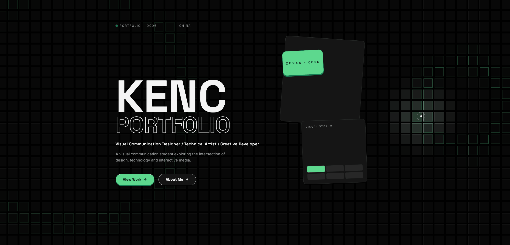
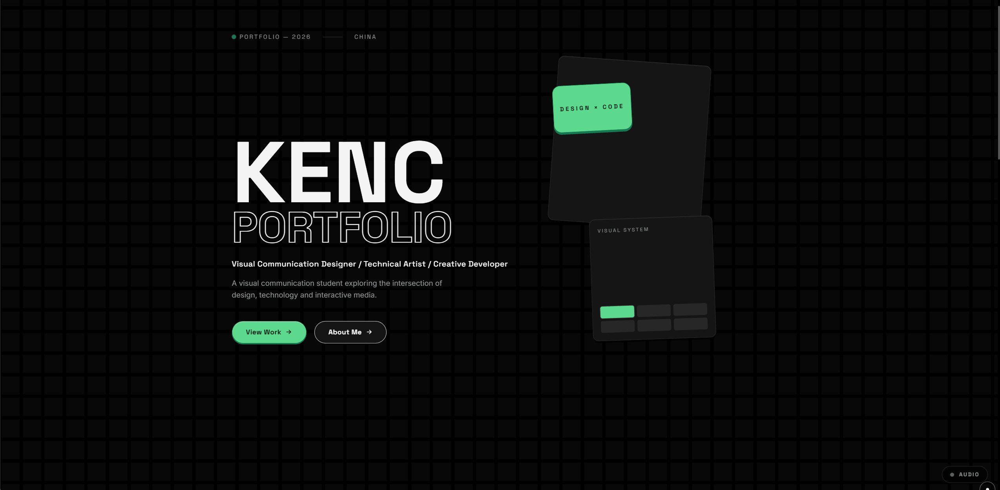

<div align=center>

# MYHERO $\color{#5DD98E}{.}$

<p style="color: #97999c; letter-spacing: 0.2em;">INTERFACE PREVIEW · STANDALONE</p>

</div>

> 受 **Wallpaper Engine** 的网页壁纸启发。从我的个人作品集网站抽离出来的 Hero 独立预览项目。一屏之内同时呈现「静态排版」与「动态物理语言」,—— 立体方块纹理、自定义光标、机械按键、深色 Tech‑粗野主义基调,适合艺术 × 技术结合的作品集门面。
>
> 顶部因预留了选项位置，实际字体位置会下坠。
>
> 仅作为 Hero 界面的独立预览,**不代表网站完整功能**。

---

## 👁️ 动效演示

主界面 + 鼠标光照轨迹:



---

## 🤔 这个 Hero 有什么

- **大字排版**:`KENC` 实心大字 + `Portfolio` 描边字上下咬合,配合职业定位文案与绿色句点收尾的节奏,构成第一视觉层级
- **CTA 实体按键**:`View Work` / `About Me` 为胶囊形圆角按钮,带底部厚度边与顶边高光,按下有真实下压回弹手感
- **背景立体方块纹理**:全屏 canvas 绘制的方块浅浮雕网格 —— 鼠标移动时,光标轨迹附近的方块被「照亮」(染薄荷绿、朝向光标的一侧浮出高光、轻微放大),划过后缓慢回落形成拖尾
- **点击下压涟漪**:点空白处会激起一圈从点击点向四周扩散的下压波 —— 波前经过的方块依次被压下(缩小、玉绿描边)再回弹;松开时被压的格子闪一下能量并再荡开一圈轻涟漪
- **音频涟漪(可选)**:右下角 `AUDIO` 玻璃按钮开启后,捕获系统/标签页正在播放的声音,**音量→涟漪大小、声谱重心→高低方位、左右声道→水平方位、起音强度→扩散速度**;本地实时分析,不录制不上传
- **动态光照阴影**:按钮与 Hero 视觉的阴影方向实时跟随鼠标位置偏移,整站使用同一套光源逻辑
- **自定义光标**:`pointer: fine` 设备上启用极简双层光标(圆点 + 外环),悬停可点击元素时圆点缩小;悬停带 `data-cursor` 的元素时外环展开为绿色标签(如 `OPEN`)
- **深色主题**:`#000000` 纯黑底 + `#F5F5F5` 浅灰正文 + `#5DD98E` 强调玉绿 —— 绿色只作为交互信号出现,不做大面积铺色

---

## 🤗 开启音频监听

点右下角 `AUDIO` 玻璃按钮,绿色脉冲点闪烁表示正在监听。



> 浏览器要求「声音 + 画面」才能分享,所以选择器会同时请求 `video` + `audio`。**画面轨会在拿到流之后立刻 `stop()`**,只保留音频用作实时频谱分析。

支持两种捕获方式:

| 分享范围 | 选项 | 监听 |
| -------- | ------- | ------- |
| 整个屏幕 | 选「整个屏幕」+ 勾「共享系统声音」 | 系统正在播放的任何声音 |
| 浏览器标签页 | 选对应标签页 + 勾「共享标签页音频」 | 该标签页正在播放的音视频 |

频谱特征 → 涟漪几何参数:

```
音量 (RMS)            → 涟漪大小 amp
声谱重心 (centroid)   → 垂直方位 (低音→底部, 高音→顶部)
左右声道平衡 (bal)    → 水平方位 (声像)
起音强度              → 扩散速度 (重音 → 快波)
```

---

## 😤 设计规范

### 调色盘

| Token | Value | Usage |
| ----- | ----- | ----- |
| `bg` | `#000000` | 纯黑底,所有面板/按钮描边/Hero 文本次色 |
| `ink` | `#F5F5F5` | 正文、深色底上的「白」 |
| `accent` | `#5DD98E` | 强调玉绿,**只用于交互信号** |
| `accent-deep` | `#147A52` | CTA 描边 / 投影 |
| `mute` | `#97999c` | 次级文案、元信息 |

### 字体

| Role | Font |
| --- | ----- |
| Display | `Space Grotesk` → `Noto Sans SC` → fallback |
| Body | `Inter` → `Noto Sans SC` → fallback |

字体走 Google Fonts 在 `index.html` 内 `<link>` 预加载。

### Tactile 系统

> 见 [src/styles/globals.css](./src/styles/globals.css) · Tactile System`

JS (`useTactile`) 只往元素上写两个 CSS 变量 `--lx` / `--ly` ∈ [-1, 1]:
光源相对元素中心的方向向量。投影偏移、底部厚度边、顶端高光全部由变量算出,**永不写死**。

```css
.tactile {
  box-shadow:
    /* 投影方向 + 长度随光源变化 */
    calc(var(--lx) * var(--depth) * -1)
    calc(var(--ly) * var(--depth) * -1 + var(--edge))
    0 var(--sblur) rgba(0, 0, 0, var(--salpha)),
    0 var(--edge) 0 -1px rgba(0, 0, 0, 0.6),  /* 底部厚度 */
    inset 0 1px 0 rgba(255, 255, 255, 0.05);   /* 顶端高光 */
}
```

### 可访问性降级

| 场景 | 行为 |
| ---- | ---- |
| `pointer: coarse`(触屏) | 关闭自定义光标，按钮阴影保持静态向下 |
| `prefers-reduced-motion: reduce` | 背景画一次静态纹理，所有 Framer Motion 退化为「直接显示」，按钮阴影去掉 transform |
| 浏览器不支持 `getDisplayMedia` | AUDIO 开关仍可见，但点击会快速失败并显示红色提示点 |

---

## 🏠 项目结构

```
Hero/
├── index.html                # 单页入口, 预加载 Google Fonts
├── package.json              # 依赖与 npm scripts
├── tsconfig.json             # TS strict 配置
├── vite.config.ts            # React + Tailwind v4 插件
├── gif/
│   ├── preview.gif           # 音频监听演示
│   └── preview0.gif          # 主界面动效演示
├── src/
│   ├── main.tsx              # React 根挂载
│   ├── App.tsx               # 仅挂 BackgroundGrid + Cursor + Hero
│   ├── vite-env.d.ts         # Vite 客户端类型 (CSS modules / import.meta.env)
│   ├── styles/
│   │   └── globals.css       # Design tokens + tactile + 滚动条 + reduced-motion
│   ├── data/
│   │   └── profile.ts        # Hero 文案数据(姓名/角色/介绍/地点)
│   ├── hooks/
│   │   └── useTactile.ts     # 鼠标 → CSS 变量写入
│   └── components/
│       ├── Hero.tsx          # ★ 从 portfolio/Home.tsx 抽离, 只保留 Hero <section>
│       ├── BackgroundGrid.tsx# 全屏 canvas 方块纹理 + 鼠标光照 + 点击涟漪 + 音频涟漪
│       ├── Cursor.tsx        # 自定义光标 + 悬停标签
│       ├── TactileButton.tsx # 机械按键按钮 (已去掉 router 依赖)
│       └── Reveal.tsx        # 滚动入场动画 wrapper(本 Demo 未直接使用, 保留供扩展)
└── README.md                 # 本文件
```

---

## 🚀 快速开始

### 依赖

```
node >= 20
```

### 安装与启动

```bash
npm install
npm run dev      # 启动 vite dev server
npm run build    # tsc 类型检查 + vite 生产构建, 产物在 dist/
npm run preview  # 本地预览构建产物
```

> 默认端口由 vite 决定 (`http://localhost:5173` 之类),启动后看终端输出即可。

### 浏览器兼容性

| 能力                          | 要求                                                          |
| ----------------------------- | ------------------------------------------------------------- |
| Tailwind v4                   | 任意现代浏览器 (CSS `@theme` 需要 Chrome 121+ / Safari 16.4+) |
| `getDisplayMedia`             | Chrome / Edge / Firefox / Safari 14+ (桌面)                  |
| CSS `@supports` (滚动条降级) | 全现代浏览器                                                   |

---

## ⚙️ 技术栈

- **React 19** + **TypeScript** (strict)
- **Vite 6** —— 构建/HMR
- **Tailwind CSS v4** —— 设计 token + 原子类 (`@theme` 配置)
- **Framer Motion 12** —— 大字 stagger / 滚动视差
- **零运行时依赖**:背景方块纹理、自定义光标、tactile 阴影全部在原生 canvas + CSS + rAF 内完成

### 渲染层级(z-index, 由下到上)

```
  -10 : BackgroundGrid <canvas>  // pointer-events: none
    0 : Hero <section>
   40 : 右下角 AUDIO 开关
  100 : Cursor 圆点 + 外环        // pointer-events: none
```

### 性能要点

- 自定义光标不触发任何 React 重渲染 —— 全 `rAF + DOM transform 直接写入`
- Tactile 阴影不依赖 React —— CSS 变量 + `transition` 平滑
- BackgroundGrid 用单一 `<canvas>` 全屏绘制,不创建 DOM 节点
- `pointermove` 全部 `{ passive: true }`,不阻塞滚动

---

## 😎 二次开发指南

### 改 Hero 文案

编辑 [`src/data/profile.ts`](./src/data/profile.ts),Hero 会自动同步 —— Hero 中只引用了 `name` / `roles` / `positioning` / `location` 四个字段。

### 改调色盘

编辑 [`src/styles/globals.css`](./src/styles/globals.css) 的 `@theme` 块:

```css
@theme {
  --color-bg: #000000;        /* 纯黑底 */
  --color-ink: #f5f5f5;       /* 主文字 */
  --color-accent: #5dd98e;    /* 强调绿(只用于交互信号) */
  --color-accent-deep: #147a52;
  --color-mute: #97999c;
}
```

### 给按钮加 hover label

在 `<TactileButton>` 上加 `cursor="OPEN"`(或其它自定义字符串) —— 光标悬停时外环会展开为绿色标签并显示该文本。

### 调方块网格密度

在 [`src/components/BackgroundGrid.tsx`](./src/components/BackgroundGrid.tsx) 顶部:

```ts
const CELL = 44;   // 方块中心间距 (px), 改小 → 更密集
const GAP = 7;     // 方块之间的缝 (px)
const RADIUS = 170;// 光标影响半径 (px), 改小 → 影响范围更集中
const DECAY = 0.94;// 每帧能量衰减 (0..1, 越接近 1 拖尾越长)
```

### 接入真实路由

若要把 Hero 嵌回完整 portfolio,只需把 `TactileButton` 的 `to="#/work"` 还原为 router 的 `Link`(参考 portfolio 的 `src/lib/router.tsx`),并在 Hero 上下挂 `RouterProvider`。

---

> Made with 🤖 + 🎨 (Figma) + ⚛️ + ☕ — by Kenc · 2026
